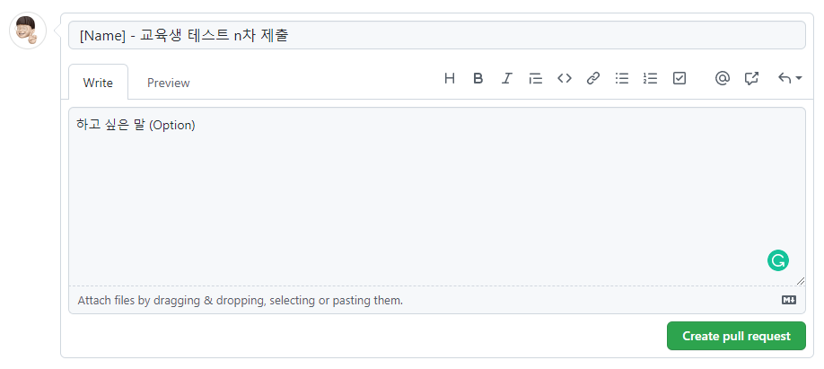

<h1 style='font-weight:700'>Welcome!</h1>
안녕하세요. 이 Repository는 1기 웅도 교육생 평가를 위해 만들어졌습니다.

<h1 style='font-weight:500'>정답지 제출 양식</h1>

- `/src/ans/[Github ID]/[File Name]` 형식으로 업로드해주세요.
- PR Title은 `[Name] - 교육생 테스트 [n]차 제출`으로 설정해주세요.
- 파일 예시: `/src/ans/kitae0522/index.ts`, `/src/ans/kitae0522/problem.ts`
- PR Title 예시: `[송기태] - 교육생 테스트 1차 제출` or `[송기태] - 교육생 테스트 최종 제출`

